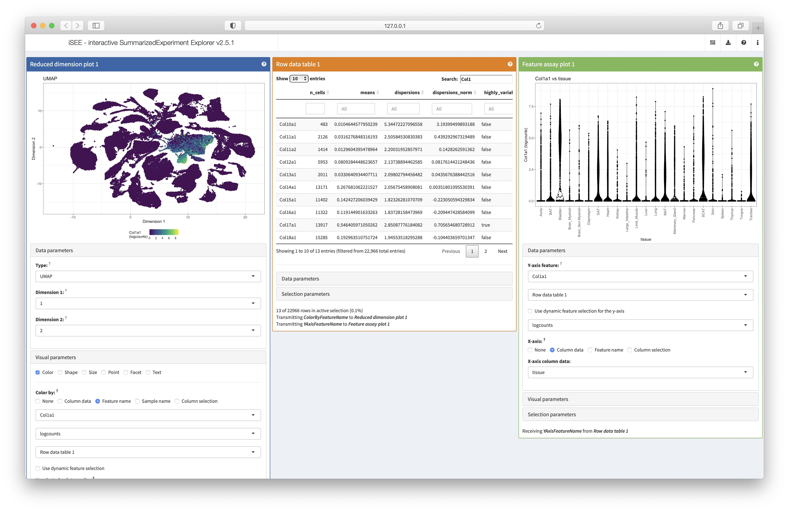

```{r, include = FALSE}
knitr::opts_chunk$set(
  collapse = TRUE,
  comment = "#>"
)
```

```{r setup, message = FALSE}
library(SingleCellExperiment)
library(TabulaMurisSenisData)
library(ggplot2)
```

# Introduction

This package provides access to the processed bulk and single-cell RNA-seq data 
from the _Tabula Muris Senis_ data set 
[@Schaum2019-nf;@Tabula_Muris_Consortium2020-um]. The processed bulk RNA-seq 
data was downloaded from GEO (accession number 
[GSE132040](https://www.ncbi.nlm.nih.gov/geo/query/acc.cgi?acc=GSE132040)). The 
single-cell data (droplet and FACS) was obtained from FigShare (see below for links).
All data sets are provided as `SingleCellExperiment` objects for easy access 
and use within the Bioconductor ecosystem. 

# Bulk RNA-seq data

The bulk RNA-seq data can be accessed via the `TabulaMurisSenisBulk()` 
function. By setting the argument `infoOnly` to `TRUE`, we can get information 
about the size of the data set before downloading it. 

```{r}
TabulaMurisSenisBulk(infoOnly = TRUE)
tms_bulk <- TabulaMurisSenisBulk()
tms_bulk
```

We list the available tissues.
```{r}
table(colData(tms_bulk)$organ)
```

# Single-cell RNA-seq data

## Droplet data

The data files for the droplet single-cell RNA-seq data were downloaded from FigShare: 

* the [full data (all tissues)](https://figshare.com/articles/dataset/Processed_files_to_use_with_scanpy_/8273102?file=23938934)
* the [data from individual tissues](https://figshare.com/articles/dataset/Tabula_Muris_Senis_Data_Objects/12654728)

We list the available tissues.

```{r}
listTabulaMurisSenisTissues(dataset = "Droplet")
```

As for the bulk data, we can print the size of the data set before 
downloading it. 

```{r}
TabulaMurisSenisDroplet(tissues = "All", infoOnly = TRUE)
tms_droplet <- TabulaMurisSenisDroplet(tissues = "All")
tms_droplet
```

We plot the UMAP of the entire data set and color by tissue, to re-create the plot from [here](https://tabula-muris-senis.ds.czbiohub.org).

```{r}
# tissue colors
tissue_cols <- c(Pancreas = "#3182bd", Thymus = "#31a354", 
                 Trachea = "#636363", Bladder = "#637939", 
                 Lung = "#7b4173", Large_Intestine = "#843c39", 
                 Fat = "#969696", Tongue = "#a1d99b", 
                 Mammary_Gland = "#ce6dbd", Limb_Muscle = "#d6616b", 
                 Marrow = "#de9ed6", Skin = "#e6550d", 
                 Liver = "#e7969c", Heart_and_Aorta = "#e7ba52", 
                 Kidney = "#e7cb94", Spleen = "#fd8d3c")

# get dataset with all tissues
se <- tms_droplet$All
se 

# prepare data set for ggplot
ds <- as.data.frame(reducedDim(se, "UMAP"))
ds <- cbind(ds, tissue = colData(se)$tissue)
head(ds)

# plot
ggplot(ds, aes(x = UMAP1, y = UMAP2, color = tissue)) + 
  geom_point(size = 0.05) + 
  scale_color_manual(values = tissue_cols) + 
  theme_classic() + 
  guides(colour = guide_legend(override.aes = list(size = 5)))
```


## FACS data

The data files for the FACS single-cell RNA-seq data were downloaded from FigShare: 

* the [full data (all tissues)](https://figshare.com/articles/dataset/Processed_files_to_use_with_scanpy_/8273102?file=23937842)
* the [data from individual tissues](https://figshare.com/articles/dataset/Tabula_Muris_Senis_Data_Objects/12654728)

We list the available tissues.

```{r}
listTabulaMurisSenisTissues(dataset = "FACS")
```

Also here, we can print the size of the data set before downloading it. 

```{r}
TabulaMurisSenisFACS(tissues = "All", infoOnly = TRUE)
tms_facs <- TabulaMurisSenisFACS(tissues = "All")
tms_facs
```

We plot the UMAP of the entire data set and color by tissue, to re-create the plot from [here](https://tabula-muris-senis.ds.czbiohub.org).

```{r}
# tissue colors
tissue_cols <- c(Skin = "#e6550d", Pancreas = "#3182bd", 
                 Limb_Muscle = "#d6616b", Heart = "#e7ba52", 
                 Spleen = "#fd8d3c", Diaphragm = "#8c6d31", 
                 Trachea = "#636363", Tongue = "#a1d99b", 
                 Thymus = "#31a354", `Brain_Non-Myeloid` = "#cedb9c", 
                 Brain_Myeloid = "#b5cf6b", Bladder = "#637939", 
                 Large_Intestine = "#843c39", BAT = "#9c9ede", 
                 GAT = "#bd9e39", MAT = "#a55194", SCAT = "#6baed6", 
                 Lung = "#7b4173", Liver = "#e7969c", 
                 Marrow = "#de9ed6", Kidney = "#e7cb94", 
                 Aorta = "#393b79", Mammary_Gland = "#ce6dbd")

# get dataset with all tissues
se <- tms_facs$All
se 

# prepare data set for ggplot
ds <- as.data.frame(reducedDim(se, "UMAP"))
ds <- cbind(ds, tissue = colData(se)$tissue)
head(ds)

# plot
ggplot(ds, aes(x = UMAP1, y = UMAP2, color = tissue)) + 
  geom_point(size = 0.05) + 
  scale_color_manual(values = tissue_cols) + 
  theme_classic() + 
  guides(colour = guide_legend(override.aes = list(size = 5)))
```

# Explore data with `iSEE`

The _Tabula Muris Senis_ datasets are provided in the form of `SingleCellExperiment` objects.  
A natural companion to this data structure is the `r Biocpkg("iSEE")` package, which can be used for interactive and reproducible data exploration.

Any analysis steps should be performed in advance before calling `iSEE`, and since these datasets can be quite big, the operations can be time consuming, and/or require a considerable amount of resources.

```{r}
sce_all_facs <- TabulaMurisSenisFACS(tissues = "All", processedCounts = TRUE)[["All"]]
sce_all_facs
```

We can see that the `sce_all_facs` contains both raw and processed counts (in the assays slots `counts` and `logcounts`), but also the PCA and UMAP embeddings as provided in the original publication.

```{r}
assayNames(sce_all_facs)
reducedDimNames(sce_all_facs)
```

If desired, additional processing steps can be performed on the `sce_all_facs` - e.g., storing signature scores (computed via `r Biocpkg("AUCell")`) as `colData` elements.  
Once these steps are completed, launching `iSEE` is as easy as 

```{r include=FALSE}
library("iSEE")
```

```{r launchisee, eval=FALSE}
library("iSEE")
iSEE(sce_all_facs)
```

This will launch `iSEE` with a standard default set of panels.  
Optionally, we can configure the `initial` set to start the app in the desired configuration - below, we show how to start `iSEE` with:

- a `ReducedDimensionPlot` displaying the UMAP, colored by the expression of a feature;
- a `RowDataTable`, for selecting a feature to be transmitted to the other panels (showing all genes whose name contains "Col1");
- a `FeatureAssayPlot`, for showing the expression of the gene selected in the `RowDataTable`, split by tissue.

```{r}
initial <- list()

################################################################################
# (Compact) Settings for Reduced dimension plot 1
################################################################################

initial[["ReducedDimensionPlot1"]] <- new(
    "ReducedDimensionPlot", 
    
    DataBoxOpen = TRUE, 
    Type = "UMAP", 
    
    VisualBoxOpen = TRUE, 
    ColorBy = "Feature name", 
    ColorByFeatureName = "Col1a1", 
    ColorByFeatureSource = "RowDataTable1", 
    ColorByFeatureDynamicSource = FALSE
)

################################################################################
# (Compact) Settings for Row data table 1
################################################################################

initial[["RowDataTable1"]] <- new(
    "RowDataTable", 
    Selected = "Col1a1", 
    Search = "Col1"
)
    
################################################################################
# (Compact) Settings for Feature assay plot 1
################################################################################

initial[["FeatureAssayPlot1"]] <- new(
    "FeatureAssayPlot", 
    
    DataBoxOpen = TRUE, 
    Assay = "logcounts", 
    XAxis = "Column data", 
    XAxisColumnData = "tissue", 
    YAxisFeatureName = "Col1a1", 
    YAxisFeatureSource = "RowDataTable1"
)

```

<details>
<br>
<summary>Click here to display the complete configuration chunk<br><br></summary>

```{r eval=FALSE}
initial <- list()

################################################################################
# Settings for Reduced dimension plot 1
################################################################################

initial[["ReducedDimensionPlot1"]] <- new("ReducedDimensionPlot", Type = "UMAP", XAxis = 1L, YAxis = 2L, 
    FacetRowByColData = "FACS.selection", FacetColumnByColData = "FACS.selection", 
    ColorByColumnData = "FACS.selection", ColorByFeatureNameAssay = "logcounts", 
    ColorBySampleNameColor = "#FF0000", ShapeByColumnData = "FACS.selection", 
    SizeByColumnData = "n_genes", FacetRowBy = "None", FacetColumnBy = "None", 
    ColorBy = "Feature name", ColorByDefaultColor = "#000000", 
    ColorByFeatureName = "Col1a1", ColorByFeatureSource = "RowDataTable1", 
    ColorByFeatureDynamicSource = FALSE, ColorBySampleName = "A10_B000497_B009023_S10.mm10-plus-0-0", 
    ColorBySampleSource = "---", ColorBySampleDynamicSource = FALSE, 
    ShapeBy = "None", SizeBy = "None", SelectionAlpha = 0.1, 
    ZoomData = numeric(0), BrushData = list(), VisualBoxOpen = TRUE, 
    VisualChoices = "Color", ContourAdd = FALSE, ContourColor = "#0000FF", 
    PointSize = 1, PointAlpha = 1, Downsample = FALSE, DownsampleResolution = 200, 
    CustomLabels = FALSE, CustomLabelsText = "A10_B000497_B009023_S10.mm10-plus-0-0", 
    FontSize = 1, LegendPointSize = 1, LegendPosition = "Bottom", 
    HoverInfo = TRUE, LabelCenters = FALSE, LabelCentersBy = "FACS.selection", 
    LabelCentersColor = "#000000", VersionInfo = list(iSEE = structure(list(
        c(2L, 5L, 1L)), class = c("package_version", "numeric_version"
    ))), PanelId = c(ReducedDimensionPlot = 1L), PanelHeight = 500L, 
    PanelWidth = 4L, SelectionBoxOpen = FALSE, RowSelectionSource = "---", 
    ColumnSelectionSource = "---", DataBoxOpen = FALSE, RowSelectionDynamicSource = FALSE, 
    ColumnSelectionDynamicSource = FALSE, RowSelectionRestrict = FALSE, 
    ColumnSelectionRestrict = FALSE, SelectionHistory = list())

################################################################################
# Settings for Row data table 1
################################################################################

initial[["RowDataTable1"]] <- new("RowDataTable", Selected = "Col1a1", Search = "Col1", SearchColumns = c("", 
"", "", "", ""), HiddenColumns = character(0), VersionInfo = list(
    iSEE = structure(list(c(2L, 5L, 1L)), class = c("package_version", 
    "numeric_version"))), PanelId = c(RowDataTable = 1L), PanelHeight = 500L, 
    PanelWidth = 4L, SelectionBoxOpen = FALSE, RowSelectionSource = "---", 
    ColumnSelectionSource = "---", DataBoxOpen = FALSE, RowSelectionDynamicSource = FALSE, 
    ColumnSelectionDynamicSource = FALSE, RowSelectionRestrict = FALSE, 
    ColumnSelectionRestrict = FALSE, SelectionHistory = list())

################################################################################
# Settings for Feature assay plot 1
################################################################################

initial[["FeatureAssayPlot1"]] <- new("FeatureAssayPlot", Assay = "logcounts", XAxis = "Column data", 
    XAxisColumnData = "tissue", XAxisFeatureName = "0610005C13Rik", 
    XAxisFeatureSource = "---", XAxisFeatureDynamicSource = FALSE, 
    YAxisFeatureName = "Col1a1", YAxisFeatureSource = "RowDataTable1", 
    YAxisFeatureDynamicSource = FALSE, FacetRowByColData = "FACS.selection", 
    FacetColumnByColData = "FACS.selection", ColorByColumnData = "age", 
    ColorByFeatureNameAssay = "logcounts", ColorBySampleNameColor = "#FF0000", 
    ShapeByColumnData = "FACS.selection", SizeByColumnData = "n_genes", 
    FacetRowBy = "None", FacetColumnBy = "None", ColorBy = "None", 
    ColorByDefaultColor = "#000000", ColorByFeatureName = "0610005C13Rik", 
    ColorByFeatureSource = "---", ColorByFeatureDynamicSource = FALSE, 
    ColorBySampleName = "A10_B000497_B009023_S10.mm10-plus-0-0", 
    ColorBySampleSource = "---", ColorBySampleDynamicSource = FALSE, 
    ShapeBy = "None", SizeBy = "None", SelectionAlpha = 0.1, 
    ZoomData = numeric(0), BrushData = list(), VisualBoxOpen = FALSE, 
    VisualChoices = "Color", ContourAdd = FALSE, ContourColor = "#0000FF", 
    PointSize = 1, PointAlpha = 1, Downsample = FALSE, DownsampleResolution = 200, 
    CustomLabels = FALSE, CustomLabelsText = "A10_B000497_B009023_S10.mm10-plus-0-0", 
    FontSize = 1, LegendPointSize = 1, LegendPosition = "Bottom", 
    HoverInfo = TRUE, LabelCenters = FALSE, LabelCentersBy = "FACS.selection", 
    LabelCentersColor = "#000000", VersionInfo = list(iSEE = structure(list(
        c(2L, 5L, 1L)), class = c("package_version", "numeric_version"
    ))), PanelId = c(FeatureAssayPlot = 1L), PanelHeight = 500L, 
    PanelWidth = 4L, SelectionBoxOpen = FALSE, RowSelectionSource = "---", 
    ColumnSelectionSource = "---", DataBoxOpen = FALSE, RowSelectionDynamicSource = FALSE, 
    ColumnSelectionDynamicSource = FALSE, RowSelectionRestrict = FALSE, 
    ColumnSelectionRestrict = FALSE, SelectionHistory = list())

initial
```

<br>

</details>

`iSEE` can then be launched with the following command:

```{r eval=FALSE}
iSEE(sce_all_facs, initial = initial)
```

```{r echo=FALSE, fig.cap="Screenshot of the iSEE app running on the FACS single cell dataset", out.width='100%'}

```

Note that these lengthy configuration options can be readily exported by clicking on the dedicated button "Display panel settings" in `iSEE` - we can do that anytime after we are done designing the configuration using the app interface.

# Session info {-}

```{r}
sessionInfo()
```

# References
